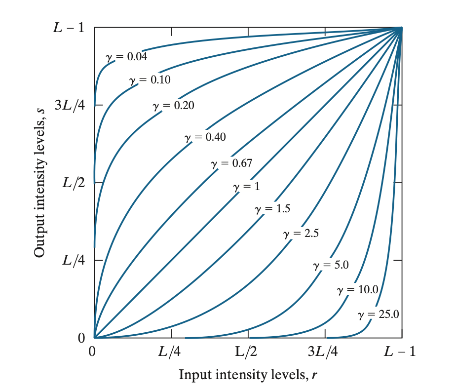
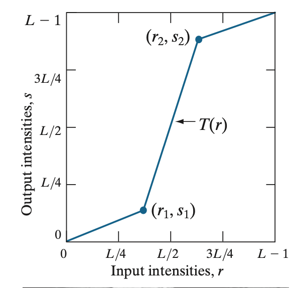
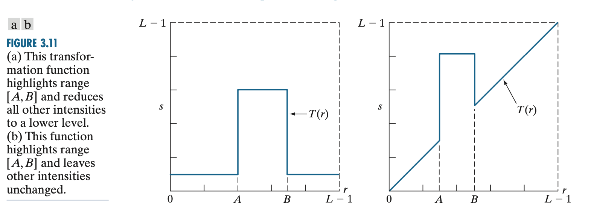
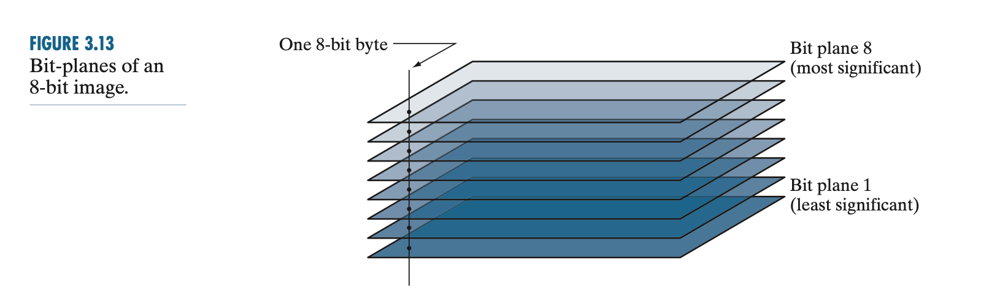

This section of the chapter discusses some basic **intensity transformation functions**, which are essential in image processing. These transformations allow you to adjust pixel intensities to achieve various effects, such as enhancing contrast, inverting the image, or compressing intensity ranges. Let me walk you through the different transformations and provide concrete examples to explain how they work.
___

### 1. **Raw Pixel Intensity Values**:

-   In some images (e.g., Fourier spectrum images, medical images, or images generated from scientific data), pixel intensities can range over a large scale, such as **0 to 1,500,000** or even higher. These raw intensities represent the data values directly, which can vary significantly based on the data source or type of image.
-   For example, the Fourier spectrum often produces very large intensity values, reflecting the magnitude of frequency components in the image. These values are essential for analysis but aren't directly suitable for display because of their wide dynamic range.

### 2. **Display Intensity Range** (e.g., 8-bit display):

-   Most displays, such as an **8-bit monitor**, can only show intensity levels ranging from **0 to 255**. This is because an 8-bit display can represent 256 distinct intensity levels, where:
    -   **0** represents black (no brightness).
    -   **255** represents white (maximum brightness).These displays cannot directly show images with intensity values ranging from 0 to 1,500,000 because the range is too wide. As a result, if the raw data is scaled linearly to fit the 8-bit range, the high values dominate, and most lower values appear too dark to notice.
___
### 1. Image Negatives (Inverse Transformation)

The **image negative transformation** is commonly used to invert the intensity levels of an image. This technique is particularly useful when enhancing white or gray details in darker regions, such as in medical X-rays or mammograms. The transformation is described by the equation:

$$s = L - 1 - r$$

Where:

-   $r$ is the input pixel intensity,
-   $s$ is the output pixel intensity,
-   $L$ is the number of possible intensity levels (e.g., 256 for an 8-bit image).

#### Example:

Consider a grayscale mammogram image where the pixel intensity levels are in the range [0, 255]. Suppose we have a pixel with intensity $r = 100$. Using the negative transformation, the output pixel intensity will be:

$s = 256 -1 - 100 = 155$

This reverses the brightness of the pixel. Darker areas become lighter, and lighter areas become darker. When applied to the entire image, the result is a "negative" version of the image, where details in the dark regions (such as lesions) become more prominent. This can help medical professionals see subtle details more clearly.

----------

### 2. Log Transformations

**Logarithmic transformations** are used to enhance images with a wide range of intensity values, especially when we need to stretch low intensity values while compressing higher ones. This can help bring out details in dark areas without losing too much detail in bright areas.

The formula for the log transformation is:

$s = c \cdot \log(1 + r)$

Where:

-   $s$ is the transformed pixel intensity.
-   $r$ is the input pixel intensity.
-   $c$ is a constant used to scale the result.
-   $\log(1 + r)$ ensures that the logarithm function works even for pixel intensities of $r = 0$, as the logarithm of zero is undefined.

This transformation maps a narrow range of low-intensity values to a wider range of output levels, enhancing dark regions while compressing brighter ones.

#### Example:

In the Fourier spectrum example, pixel intensities can range from **0 to 1.5 × 10^6**, meaning that some parts of the image have very high intensity values, while others are much darker. If this image is displayed on a typical **8-bit display**, which can show only **256 intensity levels** (from 0 to 255), the brightest pixels will dominate the display. As a result, much of the image will appear black, with only a few bright areas visible. To address this, we can apply a log transformation.

#### Without Log Transformation (Linear Scaling):

-   If we directly scale the intensity values linearly to fit the 8-bit display, most of the lower-intensity pixels will be shown as black. This is because the few very bright pixels (with values near 1.5 × 10^6) will stretch the scaling so that all the lower values are compressed into the darker range.
-   **Figure 3.5(a)** shows this effect: only the brightest areas of the Fourier spectrum are visible, while the rest of the image appears mostly black, hiding important details in the lower-intensity regions.

#### With Log Transformation:

To resolve this, we can apply the **log transformation** $s = c \cdot \log(1 + r)$ with $c = 1$. This transformation compresses the high-intensity values and expands the lower-intensity values.

-   Applying the log transformation to the pixel values changes the range of the image from $[0, 1.5 \times 10^6]$ to a much smaller range, for example, $[0, 6.2]$.
-   After this transformation, we can **scale the resulting values** to fit within the 8-bit display range (0 to 255). This allows the display to show **more details** in both the dark and bright regions of the image.
    -  For example, a pixel with intensity $r = 1,000,000$ would map to: $s = \log(1 + 1,000,000) \approx 13.82$

This compresses the wide range of intensity values into a smaller, more manageable range, making it easier to display the full spectrum of details in the image.

----------

### 3. Power-Law (Gamma) Transformations

**Power-law transformations** are widely used for contrast manipulation and gamma correction in displays. The transformation is described by the formula:

$s = c \cdot r^\gamma$

Where:

-   $s$ is the output pixel intensity.
-   $r$ is the input pixel intensity (normalized to the range [0, 1]).
-   $c$ is a constant (typically set to 1).
-   $\gamma$ is the exponent that controls how the input intensities are transformed.

The value of $\gamma$ controls whether the transformation emphasizes low-intensity or high-intensity values. When $\gamma < 1$, the transformation enhances dark regions. When $\gamma > 1$, the transformation compresses bright pixels, making them darker and reducing the dominance of bright areas. 

> For $\gamma < 1$, it enhances dark regions, as seen in the graph of $x^{0.5} = \sqrt{x}$

This flexibility makes power-law transformations very versatile. By varying the value of $\gamma$, you can achieve different effects for contrast manipulation.

### Example 1: Gamma Correction

Many display devices, like old cathode ray tube (CRT) monitors, do not display images linearly. They tend to display images darker than intended due to their **gamma** response. This gamma response follows a power-law relationship, often in the range of $\gamma = 1.8$ to $\gamma = 2.5$.

#### Problem:

If you display an image directly on a monitor with a gamma of 2.5, it will appear **darker than the original** because the monitor compresses the pixel intensities (making bright areas less bright).

#### Solution: Gamma Correction

To counter this, you apply a **gamma correction** transformation before displaying the image. The formula for gamma correction would be:

$s = r^{1/\gamma} = r^{1/2.5} \approx r^{0.4}$

By pre-processing the image with this transformation, the intensities are adjusted so that the image appears correct on the monitor. This process is demonstrated in **Figure 3.7**:

-   **Figure 3.7(a)**: Original image (intensity ramp).
-   **Figure 3.7(b)**: The image viewed on a simulated monitor with $\gamma = 2.5$, appearing darker.
-   **Figure 3.7(c)**: Gamma-corrected image, pre-processed with $s = r^{0.4}$.
-   **Figure 3.7(d)**: The gamma-corrected image, now displayed on the same monitor, appears similar to the original image, compensating for the monitor's darkening effect.

### Example 2: Contrast Enhancement Using Gamma Transformation

Power-law transformations are also widely used for **contrast enhancement**, as demonstrated in **Example 3.1**:

#### Problem:

An MRI image of a human spine (Figure 3.8(a)) is predominantly dark, making it difficult to see certain details, especially the region of the fracture.

#### Solution:

By applying a **power-law transformation** with **$\gamma < 1$**, the intensity levels in the darker regions are expanded, making more detail visible.

-   **Figure 3.8(b)**: Applying $\gamma = 0.6$ brightens the dark region of the image and reveals more details. 
-   **Figure 3.8(c)**: Applying $\gamma = 0.4$ brings out even more detail without losing contrast.
-   **Figure 3.8(d)**: Applying $\gamma = 0.3$ enhances more background details, but starts to introduce a **washed-out** effect, reducing the contrast too much.

#### Conclusion:

The best enhancement for this MRI image was obtained using $\gamma = 0.4$, where the balance between detail visibility and contrast was optimal.

### Example 3: Reducing Brightness (Washed-Out Images)

Power-law transformations are not only useful for enhancing dark images but also for compressing intensity levels in overly bright or **washed-out** images. This is demonstrated in **Example 3.2**.

#### Problem:

An aerial image (Figure 3.9(a)) appears washed out, meaning the image lacks contrast because the intensity levels are too spread out, with little differentiation between bright areas.

#### Solution:

To **compress the intensity levels** and improve contrast, a **power-law transformation** with **$\gamma > 1$** is applied.

-   **Figure 3.9(b)**: Applying $\gamma = 3.0$ reduces the brightness, making the runways and other details clearer.
-   **Figure 3.9(c)**: Applying $\gamma = 4.0$ increases contrast even more, producing a more appealing image.
-   **Figure 3.9(d)**: Applying $\gamma = 5.0$ makes the contrast even higher, making details like the airport runways stand out clearly.

For high values of $\gamma$(e.g., $\gamma = 5.0, 10.0, 25.0$), the curves are **flatter** in the dark regions and **steeper** in the bright regions, meaning the transition from dark to bright becomes more abrupt. This sharper transition can result in **higher perceived contrast**.

#### Conclusion:

For this image, values of $\gamma = 3.0$ and $\gamma = 4.0$ provide the best results, with the $\gamma = 5.0$ image showing higher contrast but potentially too much for some viewers.

### Key Takeaways:

1.  **Power-law transformations** are a powerful tool for manipulating the contrast and brightness of an image.
2.  **Gamma correction** is used to pre-process images to correct for non-linearities in display devices.
3.  By varying the value of **$\gamma$**, different effects can be achieved:
    -   $\gamma < 1$: Enhances dark regions, making details more visible.
    -   $\gamma > 1$: Compresses bright regions, improving contrast in washed-out images.
4.  These transformations can be applied in various imaging contexts, such as medical imaging (MRI) and aerial photography, to enhance image clarity and detail.

> a **washed-out effect** means that the **contrast becomes less** in the image.

___

### Piecewise Linear Transformation Functions

Piecewise linear transformation functions are a flexible method for modifying the intensity levels of an image. They allow for **arbitrary transformations** that can be tailored to specific image characteristics, which is an advantage over fixed mathematical functions like the logarithmic or power-law transformations. However, these functions often require more **user input** to define the piecewise segments, making them more complex to specify.

### Contrast Stretching

Contrast stretching is a common application of piecewise linear transformation functions. It is used to improve the contrast of images that may have **poor dynamic range** or **low contrast** due to various factors such as poor illumination, sensor limitations, or improper camera settings.

#### How Contrast Stretching Works:

-   **Low-contrast images**: These images have a narrow range of intensity values, meaning that the image looks "flat" or dull. For example, instead of utilizing the full range of pixel intensities (from black to white), the intensities might be restricted to midtones, resulting in a low-contrast image.
    
-   **Objective**: The goal of contrast stretching is to **expand the range of intensities** in the image, so that the image uses the full available intensity range (e.g., from 0 to 255 for an 8-bit image).
    
-   **Transformation**: The intensity levels are **linearly mapped** from their original narrow range to a new, wider range that spans the full intensity scale. This is achieved by defining two key points, $(r_1, s_1)$ and $(r_2, s_2)$, that control the shape of the transformation.

**Transformation Example:** In contrast stretching, we define two key points $(r_1, s_1)$ and $(r_2, s_2)$, which control the shape of the transformation. The input intensity values between $r_1$ and $r_2$ are stretched to cover a wider output intensity range.
-   $r_1, s_1$​: The point where the transformation starts (e.g., low input intensity).
-   $r_2, s_2$​: The point where the transformation ends (e.g., high input intensity).

#### Transformation Equation

For input intensity $r$, the output intensity $s$ is determined by a linear mapping between these two points:

$$s(r) = \begin{cases}
\frac{s_1}{r_1} r & \text{if } r \leq r_1 \\
\frac{s_2 - s_1}{r_2 - r_1} (r - r_1) + s_1 & \text{if } r_1 < r \leq r_2 \\
\frac{L - 1 - s_2}{L - 1 - r_2} (r - r_2) + s_2 & \text{if } r > r_2
\end{cases}$$

Where:

-   $L$ is the maximum intensity level (for an 8-bit image, $L = 256$).
-   $r_1$​ and $r_2$​ are the input intensity limits.
-   $s_1$​ and $s_2$​ are the corresponding output intensities.

    

#### Figure 3.10(a) – Transformation Function:

-   This figure shows a typical **piecewise linear transformation function** for contrast stretching.
-   The points $(r_1, s_1)$ and $(r_2, s_2)$ are used to control the stretch:
    -   **$r_1$​** and **$r_2$​** represent the lower and upper bounds of the input intensity range that needs to be stretched.
    -   **$s_1$​** and **$s_2$​** represent the output intensity values corresponding to $r_1$​ and $r_2$​.
    -   If $r_1 = r_2$​ and $s_1 = s_2$​, no change occurs in the image.

By adjusting $r_1$​, $r_2$​, $s_1$​, and $s_2$​, you can modify how much of the image’s intensity levels are stretched or compressed. For example, you can:

-   **Stretch the dark values** to use the full range of intensities.
-   **Compress the bright values** to reduce the dominance of bright regions.

#### Figure 3.10(b) – Low-Contrast Image:

-   This figure shows an **electron microscope image of pollen** with low contrast. The intensity values in this image are confined to a small range, resulting in poor visual contrast.

#### Figure 3.10(c) – Result of Contrast Stretching:

-   **After contrast stretching**, the image has been enhanced. The transformation was achieved by setting:
    
    -   $r_1 = r_{\text{min}}$(the minimum intensity value in the image).
    -   $r_2 = r_{\text{max}}$ (the maximum intensity value in the image).
    -   $s_1 = 0$ and $s_2 = L - 1$ (where $L - 1$ is the maximum possible intensity value, typically 255 for an 8-bit image).
    
    This transformation stretched the original narrow range of intensities to the **full intensity range** $[0, L-1]$, which improved the contrast and made the details of the pollen more visible.

##### Example 

Let's walk through an example to illustrate how contrast stretching works with the **piecewise linear transformation** in the case of an 8-bit low-contrast image where the intensity values range from 50 to 150. We'll see how the transformation stretches this range to the full 0–255 range.

** Original Image (Low Contrast)**

In the given example, the pixel intensity values in the image are concentrated in a narrow range: between $r_{\text{min}} = 50$ and $r_{\text{max}} = 150$. This range represents low contrast, meaning the image looks "dull" or lacks sharp differences between light and dark areas.

**Objective**

We want to stretch this range of intensities so that the pixel values spread across the full possible range of intensity values in an 8-bit image, which is [0, 255]. This will improve the contrast, making the image clearer and more detailed.

**Contrast Stretching**

We can use a **piecewise linear transformation** to stretch the intensities. The transformation function is defined by two points $(r_1, s_1)$ and $(r_2, s_2)$:

-   $r_1 = r_{\text{min}} = 50$
-   $r_2 = r_{\text{max}} = 150$
-   $s_1 = 0$ (the new minimum intensity)
-   $s_2 = 255$ (the new maximum intensity)

This transformation stretches the intensities between 50 and 150 to cover the full range from 0 to 255.

**Transformation Function**

For input intensities between $r_1 = 50$ and $r_2 = 150$, the transformation is:

$$s(r) = \frac{s_2 - s_1}{r_2 - r_1} (r - r_1) + s_1$$

Substituting the values $r_1 = 50$, $r_2 = 150$, $s_1 = 0$, and $s_2 = 255$:

$$s(r) = \frac{255 - 0}{150 - 50} (r - 50) + 0$$
$$s(r) = \frac{255}{100} (r - 50)$$
$$s(r) = 2.55 \times (r - 50)$$

** Example Calculations**

Let’s apply this transformation to a few example intensity values:

1.  **If $r = 50$** (the minimum input intensity):
    
    $$s(50) = 2.55 \times (50 - 50) = 2.55 \times 0 = 0$$
    
    The minimum intensity value in the original image (50) is mapped to 0 in the output image.
    
2.  **If $r = 100$** (an intermediate input intensity):
    
    $$s(100) = 2.55 \times (100 - 50) = 2.55 \times 50 = 127.5 \approx 128$$
    
    The input intensity value of 100 is stretched to approximately 128.
    
3.  **If $r = 150$** (the maximum input intensity):
    
    $$s(150) = 2.55 \times (150 - 50) = 2.55 \times 100 = 255$$
    
    The maximum intensity value in the original image (150) is mapped to 255 in the output image.

**Result of Contrast Stretching**

After applying this transformation to all pixel intensity values in the image:

-   The input intensity range [50, 150] is stretched to the full range [0, 255].
-   This increases the contrast in the image, as the pixel values now span the entire available range, making the dark areas darker and the bright areas brighter.

#### Figure 3.10(d) – Result of Thresholding:

-   In this image, **thresholding** was applied. Thresholding is a special case of piecewise linear transformation where the image is converted into a **binary image**:

**Explanation of Thresholding Function**

In this example, the thresholding function is defined by the following points:

-   $(r_1, s_1) = (m, 0)$
-   $(r_2, s_2) = (m, L - 1)$, where $L$ is the total number of intensity levels. For an 8-bit image, $L = 256$, but the maximum possible intensity value is **$L - 1 = 255$**.

Here, $m$ represents the **mean intensity** level of the image and serves as the **threshold** for separating pixel values into two categories.

**Transformation function**

The thresholding function transforms the image into a binary image using the following rule:

$$s(r) = \begin{cases}
0 & \text{if } r \leq m \\
L - 1 & \text{if } r > m
\end{cases}$$

Where:

-   $r$ represents the pixel intensity in the original image.
-   $s(r)$ is the resulting intensity in the binary image.
-   $m$ is the mean intensity level.
-   $L - 1$ is the maximum intensity (255 in an 8-bit image).
    
**Visual Effect of Thresholding**

The result of this transformation is that the image is converted into a **binary image**:

-   **Dark areas** (where pixel intensities are less than or equal to the mean $m$) are set to **black** (0).
-   **Bright areas** (where pixel intensities are greater than the mean $m$) are set to **white** (255).
  
This process produces a binary image that highlights the regions brighter than the threshold, while simplifying everything else to black, making it ideal for tasks like object segmentation or feature detection.

___

### Intensity-Level Slicing:

**Intensity-Level Slicing**, which is a technique used to highlight a specific range of intensities in an image. This method is useful in various applications, such as enhancing specific features in medical imaging, satellite imagery, and flaw detection in X-ray images.

There are two main approaches to intensity-level slicing, as demonstrated in **Figure 3.11 (a)** and **Figure 3.11 (b)**:

1.  **Binary Slicing (Figure 3.11(a))**:
    
    -   In this approach, the intensity values within a specified range $[A, B]$ are highlighted, usually by displaying them as white, while all other intensity values outside this range are displayed as black.
    -   The result is a **binary image**, where pixels in the intensity range of interest are white, and the rest are black. This is useful when you're only interested in the shape or structure of the highlighted regions, without considering their actual intensity values.
2.  **Range Highlighting (Figure 3.11(b))**:
    
    -   In this method, the intensity values within the range [A,B][A, B][A,B] are highlighted (brightened or darkened), while the rest of the intensity values outside this range are left unchanged.
    -   This approach is useful when you want to enhance the region of interest without losing the intensity details of other parts of the image.

### Application of Intensity-Level Slicing:

This example demonstrates intensity-level slicing applied to an **aortic angiogram**, an X-ray image of blood vessels, as seen in **Figure 3.12**. The purpose of this process is to highlight the major blood vessels, which are brighter than the background due to the injected contrast medium.

1.  **Binary Slicing (Figure 3.12(b))**:
    
    -   In this case, the intensity-level slicing transformation similar to **Figure 3.11(a)** was applied. The range of interest was set near the top of the intensity scale, highlighting the blood vessels that are lighter than the surrounding tissues.
    
    -   The result is a **binary image** where the blood vessels and parts of the kidney appear white, and all other regions appear black. This method is particularly useful for studying the shape and structure of the blood vessels, which is important for identifying any blockages.
   
2.  **Range Highlighting (Figure 3.12(c))**:
    
    -   Here, a transformation similar to **Figure 3.11(b)** was used, where a specific range of intensities was set to black, while the rest of the intensities were preserved.
    -   In this image, a mid-gray range around the mean intensity was darkened, while the blood vessels and kidney area retained their original intensity values. This method is helpful when studying the actual intensity values of the highlighted regions, which can be useful for analyzing blood flow or changes over time in a sequence of images.

### Key Takeaway:

-   **Binary slicing** (Figure 3.11(a)) simplifies the image to black and white, which is great for structural analysis.
-   **Range highlighting** (Figure 3.11(b)) retains the intensity details of the rest of the image while emphasizing the region of interest, making it ideal for cases where intensity information is important for further analysis.

The choice between these methods depends on whether you prioritize the shape and structure of the region of interest (binary slicing) or the preservation of intensity details (range highlighting).
___

### Bit-Plane Slicing 

**Bit-plane slicing** is a technique where each pixel of an image is represented as a sequence of bits (typically 8 bits for an 8-bit grayscale image), and the image is decomposed into a series of **binary images**. Each binary image corresponds to one of the bit-planes, ranging from the least significant bit (plane 1) to the most significant bit (plane 8).

### What Each Bit Plane Represents:

In an 8-bit grayscale image, each pixel value is made up of **8 bits**. These bits represent different **orders of significance**:

-   **Bit plane 1**: The **least significant bit** (LSB), representing the lowest level of intensity.
-   **Bit plane 8**: The **most significant bit** (MSB), representing the highest level of intensity.

As illustrated in **Figure 3.13**, you can imagine an 8-bit image as being composed of these **8 layers**, or **bit planes**. Each bit plane is a binary image, where each pixel is either **1** or **0**, depending on the value of the corresponding bit in the pixel’s 8-bit representation.

### Figures 3.14 and 3.15: Example of Bit-Plane Slicing

#### Figure 3.14:

-   **(a)** shows the original **8-bit grayscale image**.
-   **(b) through (i)** show the individual **bit planes** (bit planes 8 through 1).

You can see from the bit planes that:

-   The **higher-order bit planes** (bit planes 8, 7, and 6) contribute the most to the **visually significant information** in the image.
-   The **lower-order bit planes** (bit planes 1, 2, and 3) contain more subtle intensity details and have less impact on the overall visual quality.

For example:

-   The **8th bit plane** (Figure 3.14(b)) is the most significant and captures the major structures in the image.
-   The **1st bit plane** (Figure 3.14(i)) is the least significant and captures mostly noise or minor details.

### Bit Plane to Decimal Conversion:

A pixel in the original image can be reconstructed from its corresponding **binary representation** in the bit planes. For example, a pixel in the original image might have a value of **194**, which in binary is **11000010**:

-   **1 1 0 0 0 0 1 0** (from bit planes 8 to 1).

This binary representation is then converted back into the decimal value **194**.

### Figure 3.15: Image Reconstruction from Bit Planes

In this part, the bit planes are used to **reconstruct the original image**:

-   **Figure 3.15(a)** shows an image reconstructed from bit planes **8 and 7** only. The image appears **flat** because only the most significant bits are used, and thus, only a few distinct intensity levels are possible.
-   **Figure 3.15(b)** adds **bit plane 6** to the reconstruction, increasing the number of intensity levels and improving the image quality. However, there is still some **false contouring**, meaning that the transition between intensity levels is too abrupt and creates artificial contours.
-   **Figure 3.15(c)** adds **bit plane 5**, which further improves the image and reduces the false contouring.

> Image reconstruction refers to the process of creating or restoring an image from incomplete, degraded, or transformed data. It involves taking various forms of data (such as bit planes, frequency components, or projections) and processing them to produce an image that resembles or is equivalent to the original one. This process is used in many fields such as image processing, medical imaging, and data compression.
> 
> Image reconstruction from bit planes involves recombining these bit planes to restore the original image. Each bit plane is multiplied by its corresponding bit value (e.g., multiplying bit plane 8 by 128, bit plane 7 by 64, etc.) and then summed together to reconstruct the grayscale image.
